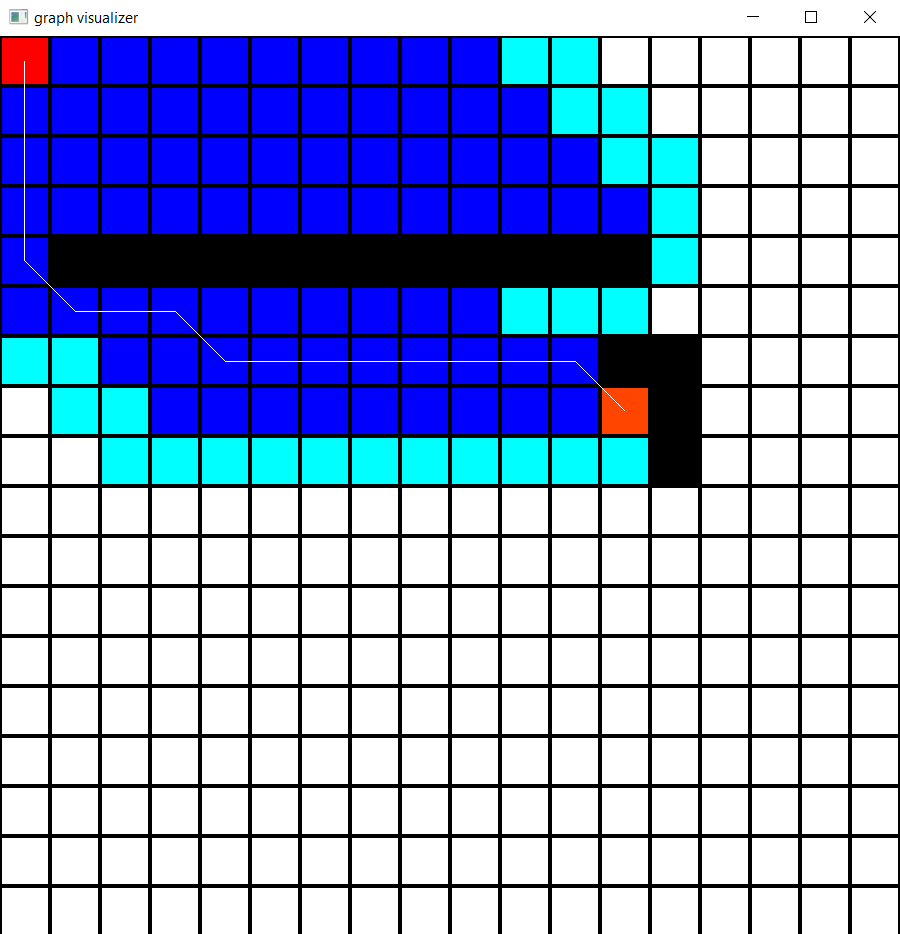
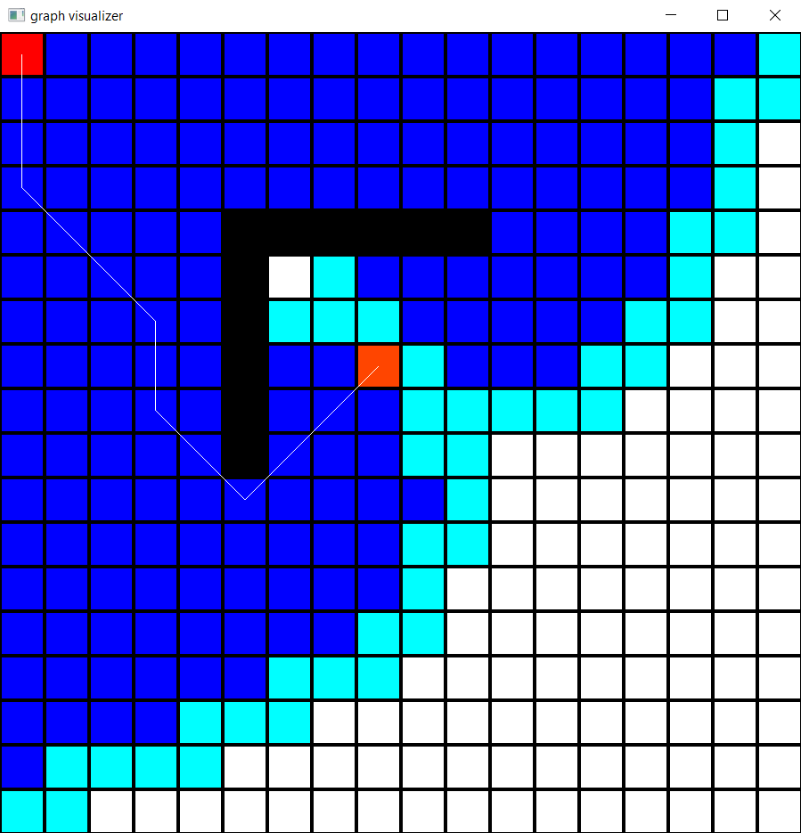
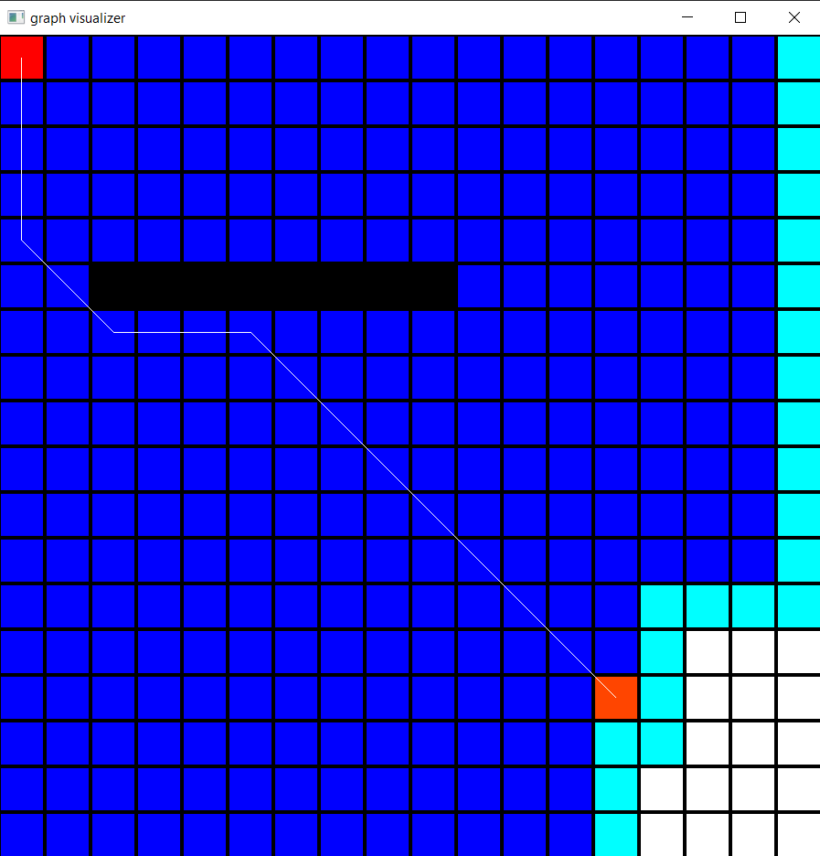
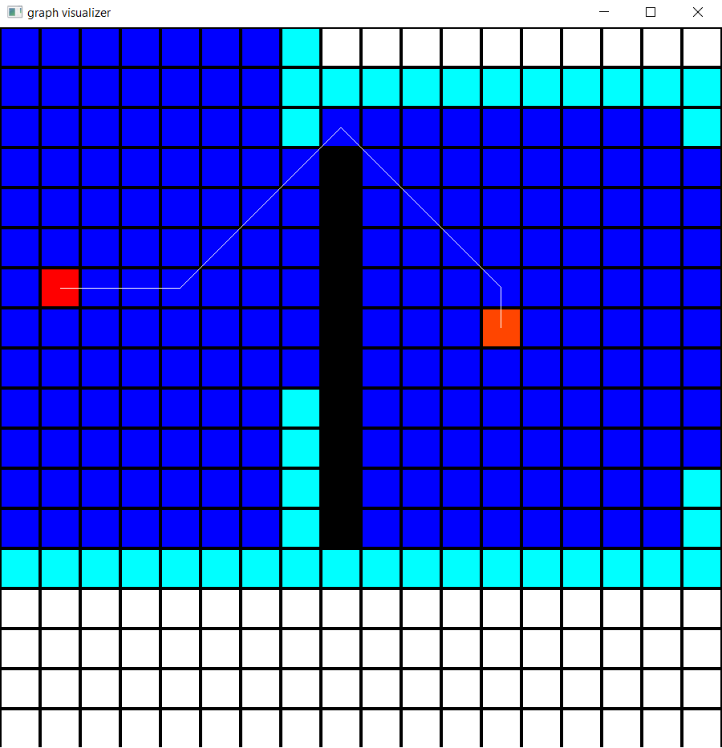
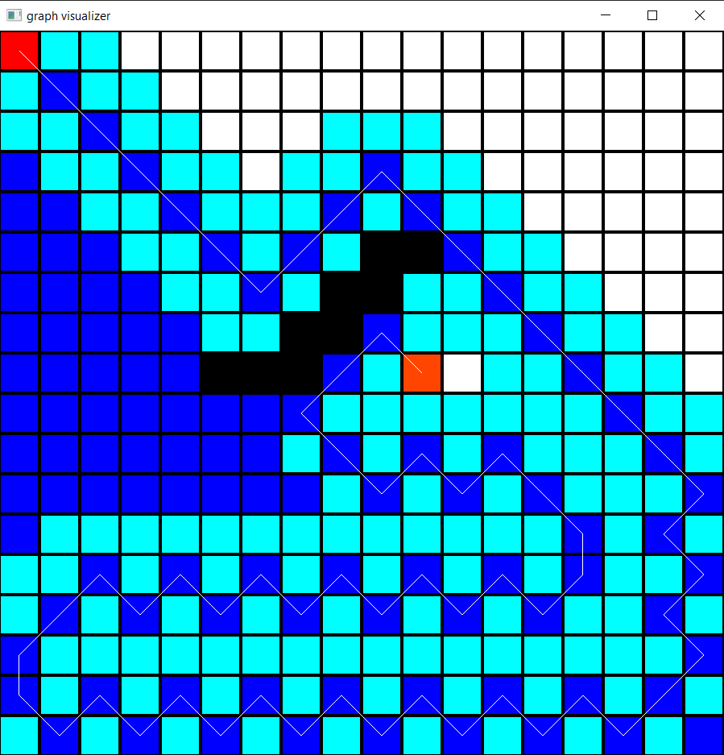
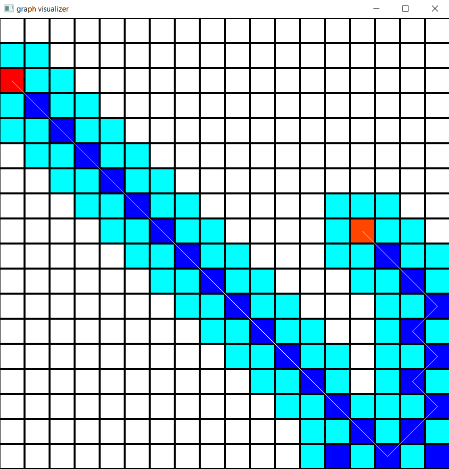
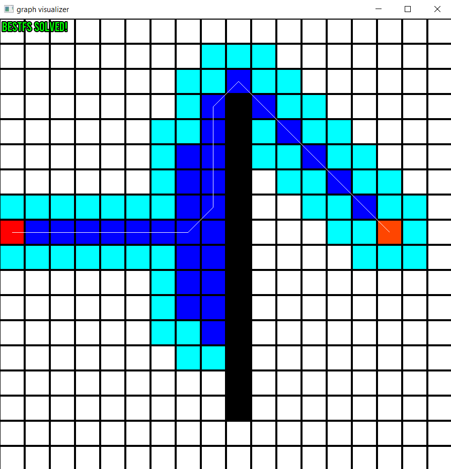

# Path-planning-visualizer
Video demo: https://www.youtube.com/watch?v=dNfxPiSixFo&feature=youtu.be 
  
An Euclidean distance grid based Path planning Visualizer for basic graph algorithms!  
      
  
## Algorithms Involved   
### A* algorithm  
  
  
### Dijkstra's Algorithm   
   
  
### Breadth First Search (BFS)  
  
  
### Bi-Directional Breadth First Search (biBFS)  
  
  
### Depth First Search (DFS)  
   
  
### Bi-Directional Depth First Search (biDFS)  
  
  
### Best First Search 
   
  
## Instructions on using the Program
Visual Studio 2017 is used. To use the program, download the repository file and open/run the solution (.sln) file.  
#### 1. Shoose an algorithm first
To change the positions of the target and source, as well as adding obstacles, an algoirhtm must be chosen first.  
To choose BFS, press Q.  
To choose DFS, press W.  
To choose dijsktra, press E.  
To choose A*, press R.  
To choose bidirectional BFS, press T.  
To choose bidirectional DFS, press Y.  
To choose Best First Search, press U.  
  
#### 2. Change source and target positions, add/remove obstacles  
To add and remove obstacles, right click on white coloured grids.
To change source and target positions, left click of the source/target, and hit enter on the grid that you want to put it on.  
   
#### 3. Solving    
press spacebar.   
  
#### 4. After solving  
repeat step 1 for other algorithms!
